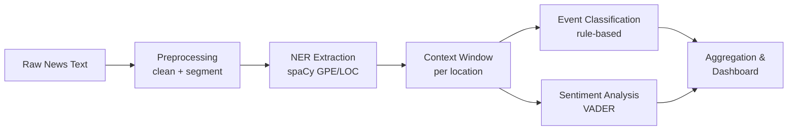

<div align="center">

# 🗺️ Location Entity Extraction & News Context Analyzer

**Identify locations in news articles and analyze the events surrounding them — automatically.**

[](https://www.python.org/)
[](https://streamlit.io/)
[](https://spacy.io/)
[](LICENSE)
[]()

<sub>Built as a micro-project for AI/DS coursework · By **Jalak Panchal** (23UF17721AI036)</sub>

</div>

---

## ✨ Overview

Locations mentioned in news carry important signals — where a disaster hit, where a protest broke out, where markets moved. This project builds an end-to-end NLP pipeline that:

- 📍 **Detects locations** (cities, countries, regions) in raw news text using spaCy NER
- 🧠 **Understands context** around each mention — what event happened, and how it reads emotionally
- 🏷️ **Classifies the event type** — disaster, political, economic, sports, or health
- 💬 **Scores sentiment** of the surrounding text using VADER
- 🌍 **Visualizes results** on an interactive map + charts in a pastel-themed Streamlit dashboard
- ✅ **Evaluates itself** with precision/recall/F1 against a hand-labeled test set

<div align="center">

*(📸 Add a screenshot or GIF of your dashboard here — see [Screenshots](#-screenshots))*

</div>

---

## 📖 Table of Contents

- [Features](#-features)
- [Demo / Screenshots](#-screenshots)
- [Tech Stack](#-tech-stack)
- [Project Structure](#-project-structure)
- [Getting Started](#-getting-started)
- [How It Works](#-how-it-works)
- [Evaluation Results](#-evaluation-results)
- [SDG Impact](#-sdg-impact)
- [Limitations & Future Work](#-limitations--future-work)
- [Author](#-author)

---

## 🚀 Features

| Feature | Description |
|---|---|
| 🔎 **Live Analyzer** | Paste any news article and get instant location + event + sentiment extraction |
| 🗺️ **Interactive Map** | See detected locations plotted globally, color-coded by event category |
| 📊 **Dataset Explorer** | Filter, search, and browse results across 50+ sample articles |
| ✅ **Built-in Evaluation** | Precision / Recall / F1 computed against a manually labeled test set |
| 🎨 **Pastel UI** | Clean, calm, presentation-ready dashboard design |

---

## 📸 Screenshots

> Replace these placeholders with real screenshots — drag & drop images into a GitHub issue/PR to get a hosted URL, then paste it below.

| Home | Live Analyzer | Dataset Explorer |
|---|---|---|
|  |  | 
 |

---

## 🛠️ Tech Stack

<div align="center">

| Layer | Tools |
|---|---|
| **NLP / NER** | [spaCy](https://spacy.io/) (`en_core_web_sm`) |
| **Sentiment** | [VADER](https://github.com/cjhutto/vaderSentiment) |
| **Data** | pandas |
| **Evaluation** | scikit-learn |
| **Visualization** | Plotly |
| **Frontend** | Streamlit |

</div>

---

## 📁 Project Structure

```
location-analyzer/
├── data/
│   ├── news_sample.csv       # 50+ sample news articles
│   └── test_labels.csv       # manually labeled test set
├── src/
│   ├── preprocessing.py      # text cleaning + sentence segmentation
│   ├── ner_extraction.py     # spaCy GPE/LOC NER + normalization
│   ├── context_analysis.py   # context window, event category, sentiment
│   ├── aggregation.py        # dataset-wide stats
│   ├── geocode.py            # static lat/lon lookup for mapping
│   └── evaluate.py           # precision / recall / F1 evaluation
├── app/
│   └── main.py                # Streamlit dashboard
├── requirements.txt
└── README.md
```

---

## ⚡ Getting Started

```bash 
# 1. Clone the repo
git clone https://github.com/<your-username>/location-entity-extraction-analyzer.git
cd location-entity-extraction-analyzer

# 2. Create a virtual environment
python -m venv venv
venv\Scripts\activate        # Windows
source venv/bin/activate     # macOS/Linux

# 3. Install dependencies
python -m pip install -r requirements.txt
python -m spacy download en_core_web_sm

# 4. Run the app
streamlit run app/main.py
```

The dashboard opens at `http://localhost:8501` 🎉

---

## ⚙️ How It Works



---

## ✅ Evaluation Results

Evaluated against a 37-example manually labeled test set:

| Metric | Score |
|---|---|
| Accuracy | **~92%** |
| Precision (macro) | 0.71 |
| Recall (macro) | 0.66 |
| F1 (macro) | 0.69 |

---

## 🌍 SDG Impact

This project aligns with:

- **SDG 11 — Sustainable Cities and Communities**: supports faster situational awareness for disaster/infrastructure events
- **SDG 16 — Peace, Justice and Strong Institutions**: helps track political unrest and governance-related events for transparency

---

## 🔮 Limitations & Future Work

- [ ] Replace rule-based classifier with a zero-shot transformer (e.g. `facebook/bart-large-mnli`)
- [ ] Add live geocoding via `geopy` for locations outside the sample dataset
- [ ] Expand dataset with a live news API integration

---

## 👤 Author

**Jalak Panchal**

Roll No: 23UF17721AI036

<div align="center">
<sub>⭐ If you found this useful, consider starring the repo!</sub>
</div>

